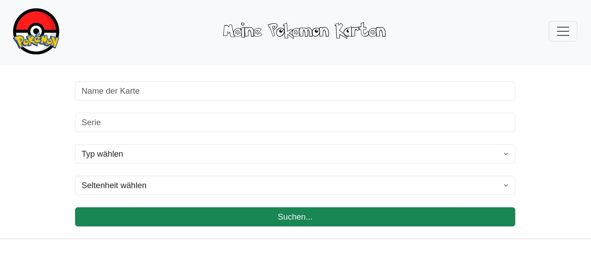

pokemon_cards.py
================
It all started when I wanted to track my magic cards...I started out with a simple csv file in gnumeric. Then I thought, it would be cool to have a better interface to search them :) Then I used flask to read the csv file an show it in my browser (eg on localhost:5000). Now I am switched to sqlite and refactored the csv stuff so that there is a import-csv option. So this is where we're at now. A simple flask app that reads Magic Cards from a sqlite db that can import cards via csv file. Then my son asked me to clone the app for his Pokemon cards. And here we are with another version of mtg_cars now called pokemon_cards :>

usage
-----
To run the app for now you'd either need a csv file like mine (pushed an an example for easier usage) or you can add single cards if you like to. But first you'd need to set up a virtual environment like this:

`python -m venv pokemon_card_venv`

Now you should have a directoy named pokemon_card_venv with some python scripts in it. The next thing would be to source the activation file in the /bin dir like that:

`source pokemon_card_venv/bin/activate`

After you did this you can go on and install flask:

`pip install flask`

Or even better install all the dependencies from the requirements.txt file:

`pip install -r requirements.txt`

Now that everything is installed to your venv directory, you can start flask like this:

`flask --app pokemon_cards run`

There are more ways to start a flask app but I thought this one is a very easy oneliner :)
Flask should start and open a port (like 5000) on your localhost ( http://localhost:5000 ). You can visit it with a browser.

And it should look somehow like this (without the font but you can get it here: https://www.dafont.com/pokemon.font )

todo
----
There are some things left to do:
* ~~mysql backend~~ now using sqlite
* deck builder
* crud methods (we only have r(ead) and create for now, u(pdate) and d(elete) are missing)

license
-------
GPLv3 (see LICENSE file)

author
------
undermink <undermink@chaostal.de>
